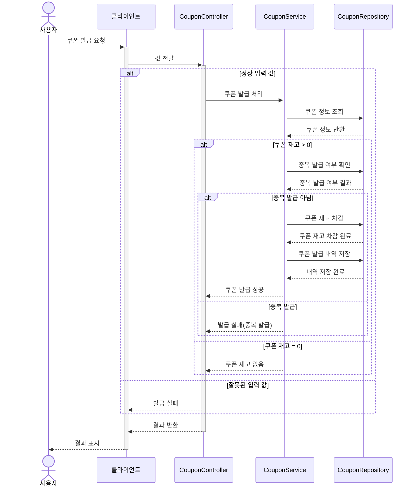

## 선착순 쿠폰 발급

```mermaid
sequenceDiagram
    actor User as 사용자
    participant Client as 클라이언트
    participant Controller as CouponController
    participant Service as CouponService
    participant DB as CouponRepository

    User->>+Client: 쿠폰 발급 요청
    Client->>+Controller: 값 전달
    alt 정상 입력 값
        Controller->>+Service: 쿠폰 발급 처리
        Service->>DB: 쿠폰 정보 조회
        DB-->>Service: 쿠폰 정보 반환 
        alt 쿠폰 재고 > 0 
            Service->>DB: 중복 발급 여부 확인
            DB-->>Service: 중복 발급 여부 결과
            alt 중복 발급 아님
                Service->>DB: 쿠폰 재고 차감
                DB-->>Service: 쿠폰 재고 차감 완료
                Service->>DB: 쿠폰 발급 내역 저장
                DB-->>Service: 내역 저장 완료
                Service-->>Controller: 쿠폰 발급 성공
            else 중복 발급
                Service-->>Controller: 발급 실패(중복 발급)
            end
        else 쿠폰 재고 = 0
            Service-->>Controller: 쿠폰 재고 없음
        end
    else 잘못된 입력 값
        Controller-->>Client: 발급 실패
    end
    Controller-->>-Client: 결과 반환
    Client-->>-User: 결과 표시
```