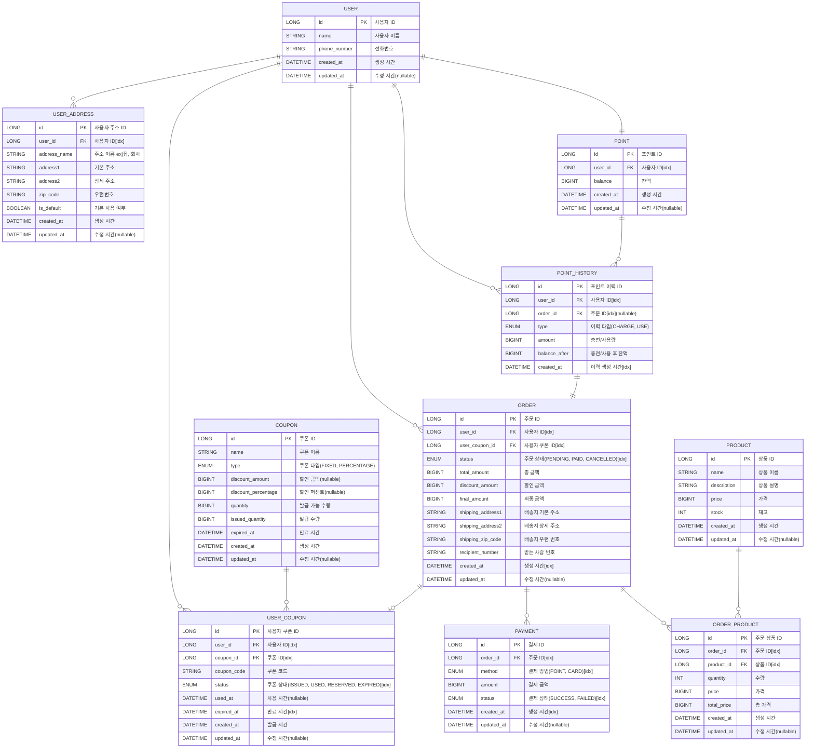

```mermaid
erDiagram
    USER {
        LONG id PK "사용자 ID"
        STRING name "사용자 이름"
        STRING phone_number "전화번호"
        DATETIME created_at "생성 시간"
        DATETIME updated_at "수정 시간(nullable)"
    }
    USER_ADDRESS {
        LONG id PK "사용자 주소 ID"
        LONG user_id FK "사용자 ID[idx]"
        STRING address_name "주소 이름 ex)집, 회사"
        STRING address1 "기본 주소"
        STRING address2 "상세 주소"
        STRING zip_code "우편번호"
        BOOLEAN is_default "기본 사용 여부"
        DATETIME created_at "생성 시간"
        DATETIME updated_at "수정 시간(nullable)"
    }
    POINT {
        LONG id PK "포인트 ID"
        LONG user_id FK "사용자 ID[idx]"
        BIGINT balance "잔액"
        DATETIME created_at "생성 시간"
        DATETIME updated_at "수정 시간(nullable)"
    }
    POINT_HISTORY {
        LONG id PK "포인트 이력 ID"
        LONG user_id FK "사용자 ID[idx]"
        LONG order_id FK "주문 ID[idx](nullable)"
        ENUM type "이력 타입(CHARGE, USE)"
        BIGINT amount "충전/사용량"
        BIGINT balance_after "충전/사용 후 잔액"
        DATETIME created_at "이력 생성 시간[idx]"
    }
    COUPON {
        LONG id PK "쿠폰 ID"
        STRING name "쿠폰 이름"
        ENUM type "쿠폰 타입(FIXED, PERCENTAGE)"
        BIGINT discount_amount "할인 금액(nullable)"
        BIGINT discount_percentage "할인 퍼센트(nullable)"
        BIGINT quantity "발급 가능 수량"
        BIGINT issued_quantity "발급 수량"
        DATETIME expired_at "만료 시간"
        DATETIME created_at "생성 시간"
        DATETIME updated_at "수정 시간(nullable)"
    }
    USER_COUPON {
        LONG id PK "사용자 쿠폰 ID"
        LONG user_id FK "사용자 ID[idx]"
        LONG coupon_id FK "쿠폰 ID[idx]"
        STRING coupon_code "쿠폰 코드"
        ENUM status "쿠폰 상태(ISSUED, USED, RESERVED, EXPIRED)[idx]"
        DATETIME used_at "사용 시간(nullable)"
        DATETIME expired_at "만료 시간[idx]"
        DATETIME created_at "발급 시간"
        DATETIME updated_at "수정 시간(nullable)"
    }
    PRODUCT {
        LONG id PK "상품 ID"
        STRING name "상품 이름"
        STRING description "상품 설명"
        BIGINT price "가격"
        INT stock "재고"
        DATETIME created_at "생성 시간"
        DATETIME updated_at "수정 시간(nullable)"
    }
    ORDER {
        LONG id PK "주문 ID"
        LONG user_id FK "사용자 ID[idx]"
        LONG user_coupon_id FK "사용자 쿠폰 ID[idx]"
        ENUM status "주문 상태(PENDING, PAID, CANCELLED)[idx]"
        BIGINT total_amount "총 금액"
        BIGINT discount_amount "할인 금액"
        BIGINT final_amount "최종 금액"
        STRING shipping_address1 "배송지 기본 주소"
        STRING shipping_address2 "배송지 상세 주소"
        STRING shipping_zip_code "배송지 우편 번호"
        STRING recipient_number "받는 사람 번호"
        DATETIME created_at "생성 시간[idx]"
        DATETIME updated_at "수정 시간(nullable)"
    }
    ORDER_PRODUCT {
        LONG id PK "주문 상품 ID"
        LONG order_id FK "주문 ID[idx]"
        LONG product_id FK "상품 ID[idx]"
        INT quantity "수량"
        BIGINT price "가격"
        BIGINT total_price "총 가격"
        DATETIME created_at "생성 시간"
        DATETIME updated_at "수정 시간(nullable)"
    }
    PAYMENT {
        LONG id PK "결제 ID"
        LONG order_id FK "주문 ID[idx]"
        ENUM method "결제 방법(POINT, CARD)[idx]"
        BIGINT amount "결제 금액"
        ENUM status "결제 상태(SUCCESS, FAILED)[idx]"
        DATETIME created_at "생성 시간[idx]"
        DATETIME updated_at "수정 시간(nullable)"
    }
    
    USER ||--|| POINT: ""
    USER ||--o{ POINT_HISTORY: ""
    USER ||--o{ USER_COUPON: ""
    USER ||--o{ USER_ADDRESS: ""
    USER ||--o{ ORDER: ""
    
    POINT ||--o{ POINT_HISTORY: ""
    
    POINT_HISTORY ||--|| ORDER: ""
    
    COUPON ||--o{ USER_COUPON: ""
    
    ORDER ||--o{ ORDER_PRODUCT: ""
    ORDER ||--o| USER_COUPON: ""
    ORDER ||--o{ PAYMENT: ""
    
    PRODUCT ||--o{ ORDER_PRODUCT: ""
```