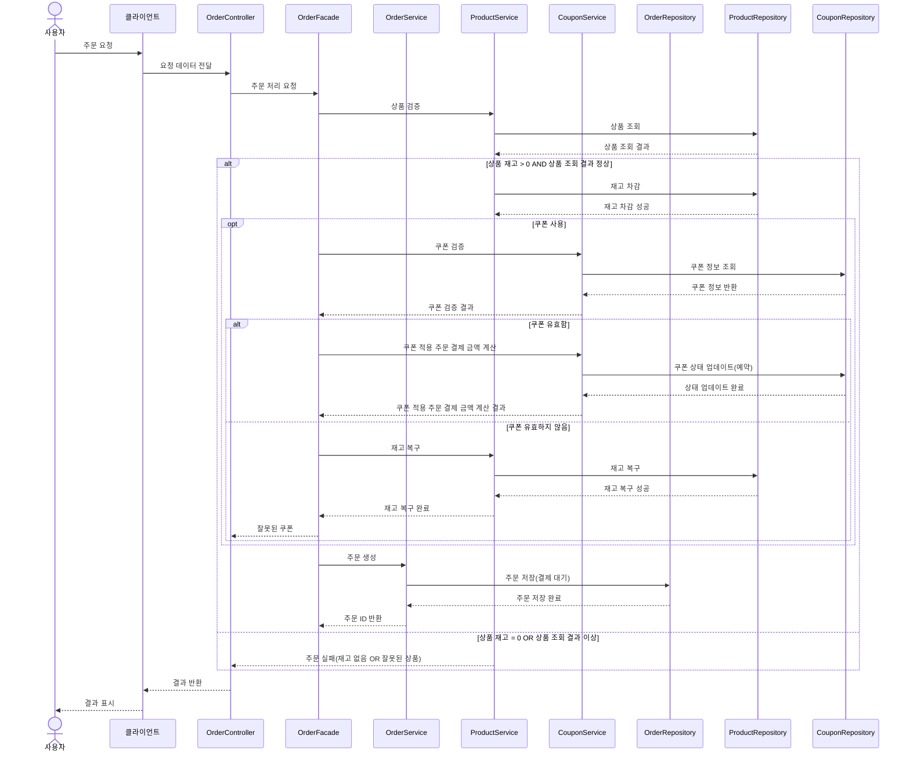
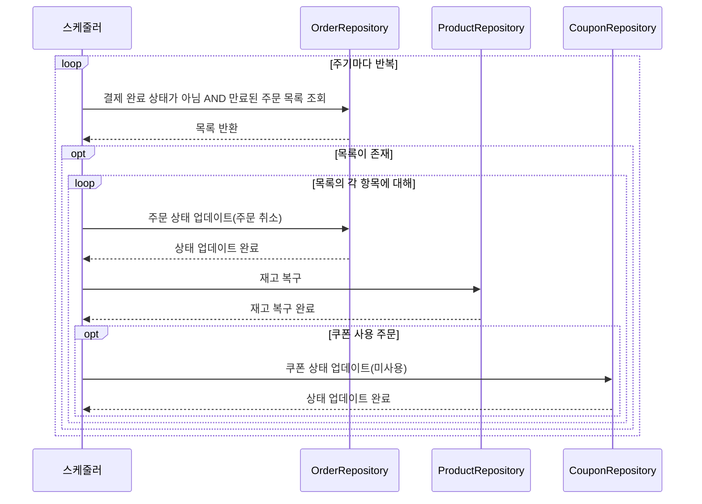

```mermaid
sequenceDiagram
    actor User as 사용자
    participant Client as 클라이언트
    participant OrderController
    participant OrderFacade
    participant OrderService
    participant ProductService
    participant CouponService
    participant OrderRepository
    participant ProductRepository
    participant CouponRepository

    User->>Client: 주문 요청
    Client->>OrderController: 요청 데이터 전달
    OrderController->>OrderFacade: 주문 처리 요청
    OrderFacade->>ProductService: 상품 검증
    ProductService->>ProductRepository: 상품 조회
    ProductRepository-->>ProductService: 상품 조회 결과
    alt 상품 재고 > 0 AND 상품 조회 결과 정상
        ProductService->>ProductRepository: 재고 차감
        ProductRepository-->>ProductService: 재고 차감 성공

        opt 쿠폰 사용
            OrderFacade->>CouponService: 쿠폰 검증
            CouponService->>CouponRepository: 쿠폰 정보 조회
            CouponRepository-->>CouponService: 쿠폰 정보 반환
            CouponService-->>OrderFacade: 쿠폰 검증 결과

            alt 쿠폰 유효함
                OrderFacade->>CouponService: 쿠폰 적용 주문 결제 금액 계산
                CouponService->>CouponRepository: 쿠폰 상태 업데이트(예약)
                CouponRepository-->>CouponService: 상태 업데이트 완료
                CouponService-->>OrderFacade: 쿠폰 적용 주문 결제 금액 계산 결과
            else 쿠폰 유효하지 않음
                OrderFacade->>ProductService: 재고 복구
                ProductService->>ProductRepository: 재고 복구
                ProductRepository-->>ProductService: 재고 복구 성공
                ProductService-->>OrderFacade: 재고 복구 완료
                OrderFacade-->>OrderController: 잘못된 쿠폰
            end
        end

        OrderFacade->>OrderService: 주문 생성
        OrderService->>OrderRepository: 주문 저장(결제 대기)
        OrderRepository-->>OrderService: 주문 저장 완료
        OrderService-->>OrderFacade: 주문 ID 반환
    else 상품 재고 = 0 OR 상품 조회 결과 이상
        ProductService-->>OrderController: 주문 실패(재고 없음 OR 잘못된 상품)
    end
    OrderController-->>Client: 결과 반환
    Client-->>User: 결과 표시
```

```mermaid
sequenceDiagram
    participant Scheduler as 스케줄러
    participant OrderRepository
    participant ProductRepository
    participant CouponRepository
    
    loop 주기마다 반복
        Scheduler->>OrderRepository: 결제 완료 상태가 아님 AND 만료된 주문 목록 조회
        OrderRepository-->>Scheduler: 목록 반환
        
        opt 목록이 존재
            loop 목록의 각 항목에 대해
                Scheduler->>OrderRepository: 주문 상태 업데이트(주문 취소)
                OrderRepository-->>Scheduler: 상태 업데이트 완료
                
                Scheduler->>ProductRepository: 재고 복구
                ProductRepository-->>Scheduler: 재고 복구 완료
                
                opt 쿠폰 사용 주문
                    Scheduler->>CouponRepository: 쿠폰 상태 업데이트(미사용)
                    CouponRepository-->>Scheduler: 상태 업데이트 완료
                end
            end
        end
    end
```