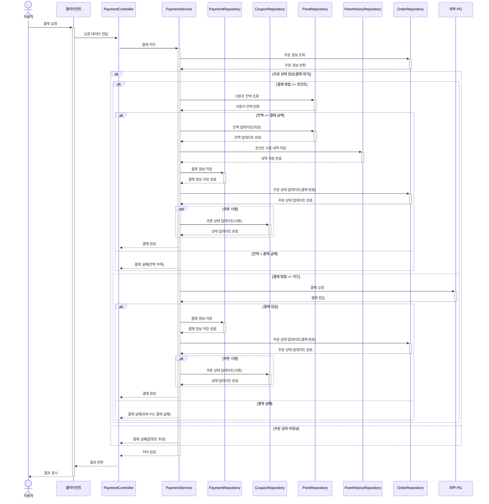

## 결제

```mermaid
sequenceDiagram
    actor User as 사용자
    participant Client as 클라이언트
    participant PaymentController
    participant PaymentService
    participant PaymentRepository
    participant CouponRepository
    participant PointRepository
    participant PointHistoryRepository
    participant OrderRepository
    participant PG as 외부 PG
    
    User->>+Client: 결제 요청
    Client->>+PaymentController: 요청 데이터 전달
    PaymentController->>+PaymentService: 결제 처리
    PaymentService->>+OrderRepository: 주문 정보 조회
    OrderRepository-->>-PaymentService: 주문 정보 반환
    
    alt 주문 상태 정상(결제 대기)
        alt 결제 방법 == 포인트
            PaymentService->>+PointRepository: 사용자 잔액 조회
            PointRepository-->>-PaymentService: 사용자 잔액 반환
            alt 잔액 >= 결제 금액
                PaymentService->>+PointRepository: 잔액 업데이트(차감)
                PointRepository-->>-PaymentService: 잔액 업데이트 완료
                PaymentService->>+PointHistoryRepository: 포인트 사용 내역 저장
                PointHistoryRepository-->>-PaymentService: 내역 저장 완료
                
                PaymentService->>+PaymentRepository: 결제 정보 저장
                PaymentRepository-->>-PaymentService: 결제 정보 저장 완료
                
                PaymentService->>+OrderRepository: 주문 상태 업데이트(결제 완료)
                OrderRepository-->>-PaymentService: 주문 상태 업데이트 완료
                
                opt 쿠폰 사용
                    PaymentService->>+CouponRepository: 쿠폰 상태 업데이트(사용)
                    CouponRepository-->>-PaymentService: 상태 업데이트 완료
                end
                
                PaymentService-->>PaymentController: 결제 완료
            else 잔액 < 결제 금액
                PaymentService-->>PaymentController: 결제 실패(잔액 부족)
            end
        else 결제 방법 == 카드
            PaymentService->>+PG: 결제 요청
            PG-->>-PaymentService: 결제 응답
            alt 결제 성공
                PaymentService->>+PaymentRepository: 결제 정보 저장
                PaymentRepository-->>-PaymentService: 결제 정보 저장 완료

                PaymentService->>+OrderRepository: 주문 상태 업데이트(결제 완료)
                OrderRepository-->>-PaymentService: 주문 상태 업데이트 완료

                alt 쿠폰 사용
                    PaymentService->>+CouponRepository: 쿠폰 상태 업데이트(사용)
                    CouponRepository-->>-PaymentService: 상태 업데이트 완료
                end

                PaymentService-->>PaymentController: 결제 완료
            else 결제 실패
                PaymentService-->>PaymentController: 결제 실패(외부 PG 결제 실패)
            end
        end
    else 주문 상태 비정상
        PaymentService-->>PaymentController: 결제 실패(잘못된 주문)
    end
    PaymentService-->>-PaymentController: 처리 완료
    PaymentController-->>Client: 결과 반환
    Client-->>-User: 결과 표시
```