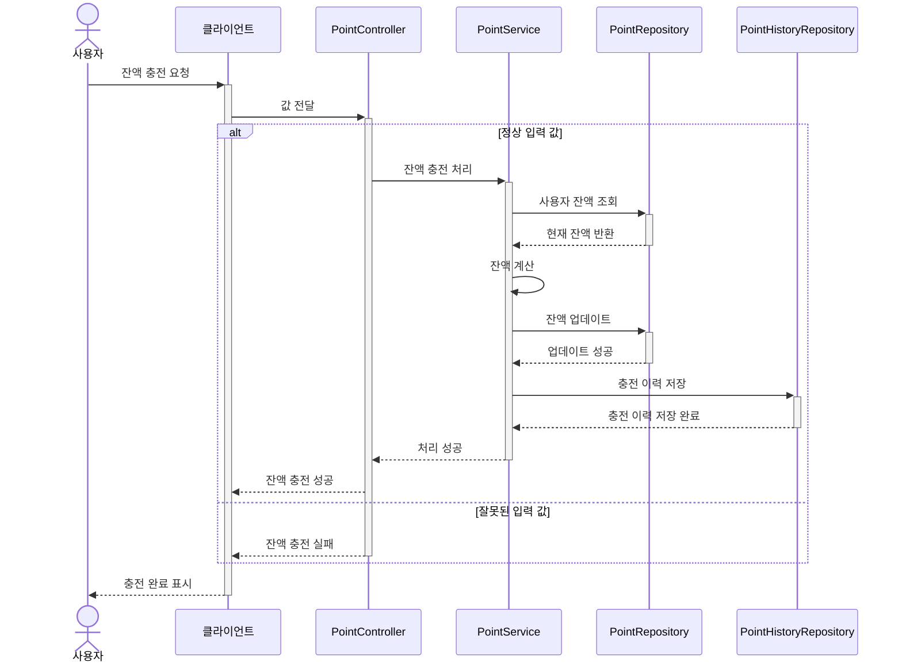

## 잔액 충전

```mermaid
sequenceDiagram
    actor User as 사용자
    participant Client as 클라이언트
    participant Controller as PointController
    participant Service as PointService
    participant PointRepository
    participant PointHistoryRepository

    User->>+Client: 잔액 충전 요청
    Client->>+Controller: 값 전달
    alt 정상 입력 값
        Controller->>+Service: 잔액 충전 처리
        Service->>+PointRepository: 사용자 잔액 조회
        PointRepository-->>-Service: 현재 잔액 반환
        Service->>Service: 잔액 계산
        Service->>+PointRepository: 잔액 업데이트
        PointRepository-->>-Service: 업데이트 성공
        Service->>+PointHistoryRepository: 충전 이력 저장
        PointHistoryRepository-->>-Service: 충전 이력 저장 완료
        Service-->>-Controller: 처리 성공
        Controller-->>Client: 잔액 충전 성공 
    else 잘못된 입력 값
        Controller-->>-Client: 잔액 충전 실패
    end
    Client-->>-User: 충전 완료 표시
```