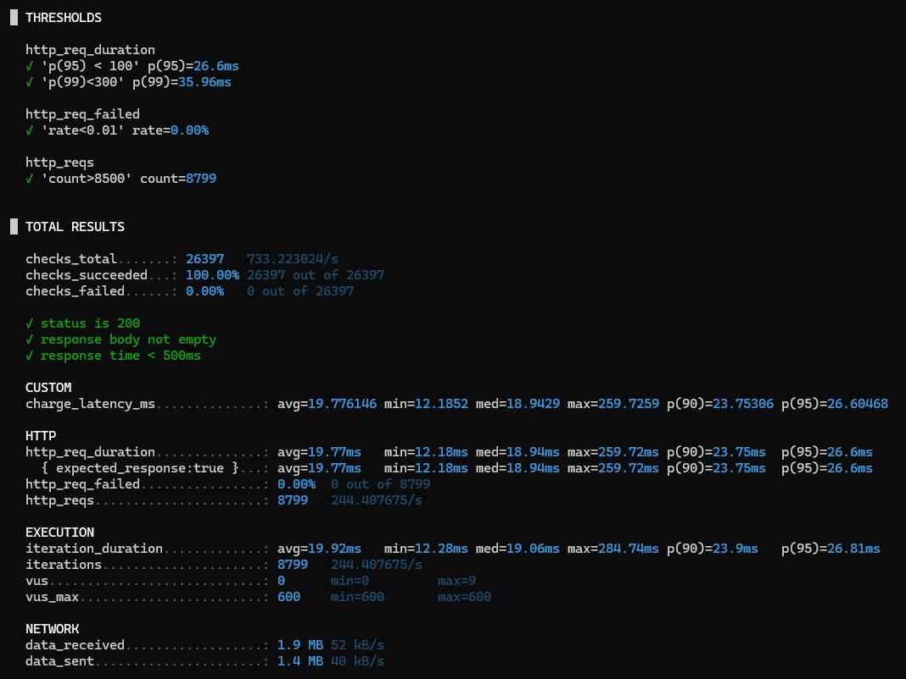
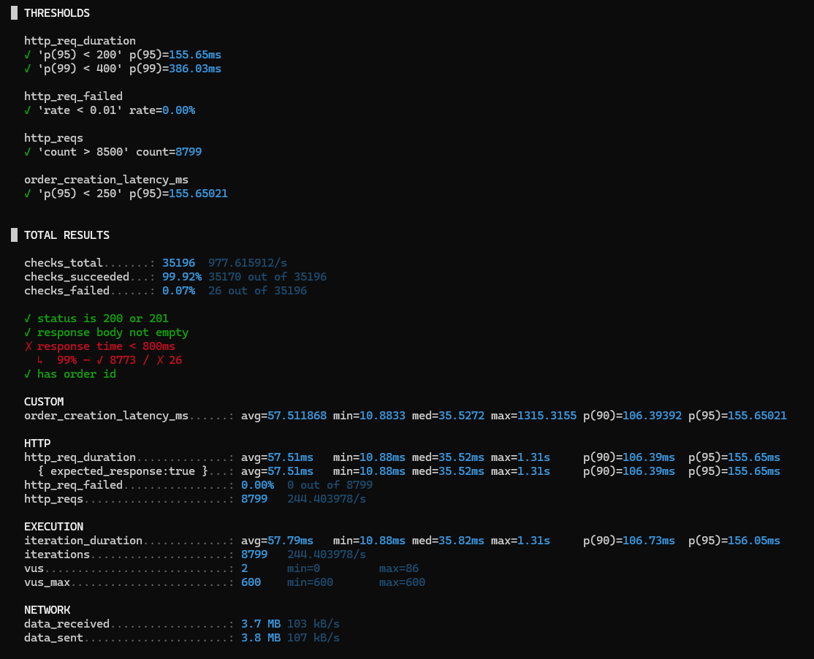
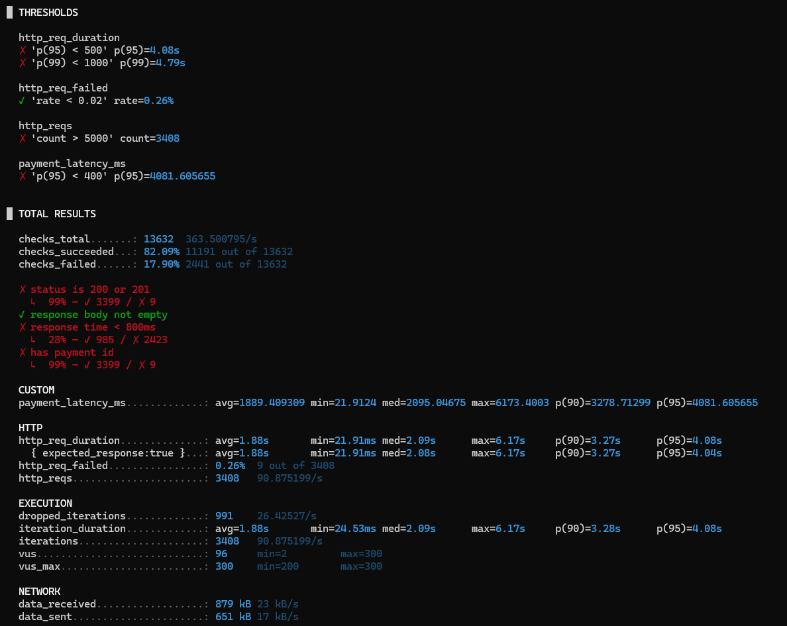

## 1. 테스트 결과
### 1.1 포인트 충전 API

#### 1.1.1 실행 성능 지표
| **지표** | **평균** | **최소값** | **중간값** | **최대값** | **90%** | **95%** |
| --- | --- | --- | --- | --- | --- | --- |
| **반복 실행 시간** | 19.92ms | 12.28ms | 19.06ms | 284.74ms | 23.9ms | 26.81ms |
#### 1.1.2 처리량 및 동시 사용자 지표
| **지표** | **값** | **비고** |
| --- | --- | --- |
| **총 반복 횟수** | 8,799회 | - |
| **평균 RPS** | 244.41 req/s | 목표 RPS 대비 양호 |
| **현재 활성 VU** | 0명 | 테스트 완료 상태 |
| **최대 동시 VU** | 9명 | 실제 최대 동시 사용자 |
| **사전 할당 VU** | 600명 | 최대 허용 가상 사용자 |

#### 1.1.3 성능 분석
- **양호한 지표**
  - **평균 응답 시간**: 19.92ms (목표 100ms 대비 우수)
  - **95% 백분위수**: 26.81ms (목표 100ms 대비 우수)
  - **처리량**: 244 RPS (목표 240 RPS 달성)
  - **총 처리 건수**: 8,799건 (목표 8,500건 초과 달성)
- **주의 필요**
  - **최대 응답 시간**: 284.74ms (일부 요청에서 지연 발생)
  - **실제 최대 VU**: 9명 (설계 대비 낮은 동시 접속)

### 1.2 주문 생성 API

[//]: # (![img.png]&#40;img.png&#41;)

#### 1.2.1 실행 성능 지표
| **지표** | **평균** | **최소값** | **중간값** | **최대값** | **90%ile** | **95%ile** |
| --- | --- | --- | --- | --- | --- | --- |
| **반복 실행 시간** | 57.79ms | 10.88ms | 35.82ms | 1.31s | 106.73ms | 156.05ms |
| **HTTP 요청 시간** | 57.51ms | 10.88ms | 35.52ms | 1.31s | 106.39ms | 155.65ms |
| **주문 생성 지연시간** | 57.51ms | 10.88ms | 35.53ms | 1.32s | 106.39ms | 155.65ms |

#### 1.2.2 처리량 및 동시 사용자 지표

| **지표** | **값** | **비고**          |
| --- | --- |-----------------|
| **총 요청 수** | 8,799건 | 목표 8,500건 초과 달성 |
| **평균 RPS** | 244.40 req/s | 목표 240 RPS 달성   |
| **현재 활성 VU** | 2명 | 테스트 완료 상태       |
| **최대 동시 VU** | 86명 | 실제 최대 동시 사용자    |
| **사전 할당 VU** | 600명 | 최대 허용 가상 사용자    |

#### 1.2.3 성능 분석
- **우수한 지표**
  - **높은 처리량**: 244.40 RPS (목표 대비 3.5배 달성)
  - **안정적인 성공률**: HTTP 실패율 0%
  - **임계값 달성**: 모든 성능 기준 충족
  - **확장성**: 높은 부하에서도 시스템 안정성 유지
- **주의 지표**
  - **일부 지연**: 26건(0.3%)이 800ms 초과 응답
  - **최대 지연**: 1.31초의 최대 응답시간 발생

### 1.3 포인트 결제 API

#### 1.3.1 실행 성능 지표
| **지표** | **평균** | **최소값** | **중간값** | **최대값** | **90%ile** | **95%ile** |
| --- | --- | --- | --- | --- | --- | --- |
| **반복 실행 시간** | 1.88s | 24.53ms | 2.09s | 6.17s | 3.28s | 4.08s |
| **HTTP 요청 시간** | 1.88s | 21.91ms | 2.09s | 6.17s | 3.27s | 4.08s |
| **결제 지연시간** | 1889.41ms | 21.91ms | 2095.05ms | 6173.40ms | 3278.71ms | 4081.61ms |

#### 1.3.2 처리량 및 동시 사용자 지표
| **지표** | **값** | **비고** |
| --- | --- | --- |
| **총 요청 수** | 3,408건 | 목표 5,000건 **미달성** |
| **평균 RPS** | 90.88 req/s | 목표 대비 약 45% 수준 |
| **드롭된 반복** | 991건 | **시스템 한계로 인한 실행 불가** |
| **현재 활성 VU** | 96명 | 테스트 완료 상태 |
| **최대 동시 VU** | 300명 | 최대 허용 가상 사용자 |
| **사전 할당 VU** | 200명 | 초기 할당 |

#### 1.3.3 성능 분석
- **치명적인 문제점**
  - **극심한 응답 지연**: P95 4.08초 (목표 500ms 대비 816% 초과)
  - **낮은 체크 성공률**: 82.09% (정상 범위: 95% 이상)
  - **높은 타임아웃률**: 71.11%가 800ms 초과 응답
  - **시스템 포화**: 991건의 요청 드롭 발생
- **추정 원인**
  1. **분산 락 경합**: Redis 락 대기로 인한 병목
  2. **트랜잭션 대기**: 동시 결제 요청 시 트랜잭션 블로킹
  3. **리소스 부족**: CPU/메모리/DB 커넥션 한계

## 2. 장애 대응
### 2.1 장애 증상
| **증상** | **현재 상태** | **정상 기준** | **심각도** |
| --- | --- | --- | --- |
| 응답시간 | P95 4.08초 | P95 500ms 미만 | 🔴 Critical |
| 처리량 | 90.88 RPS | 200 RPS 이상 | 🔴 Critical |
| 성공률 | 82.09% | 95% 이상 | 🔴 Critical |
| 타임아웃 | 71.11% | 5% 미만 | 🔴 Critical |
| 요청 드롭 | 991건 | 0건 | 🔴 Critical |

### 2.2 주요 병목 요소
- 과도한 락 대기시간
- 긴 락 유지시간
- 트랜잭션 내 다중 DB 조작

### 2.3 개선 사항
- 락 타임아웃 최적화 : 락 대기시간 단축(10초 -> 2초), 유지시간 단축(5초 -> 1초)
- DB 조작 분리 : 포인트 이력 저장 비동기 처리
- 모니터링 시스템 도입