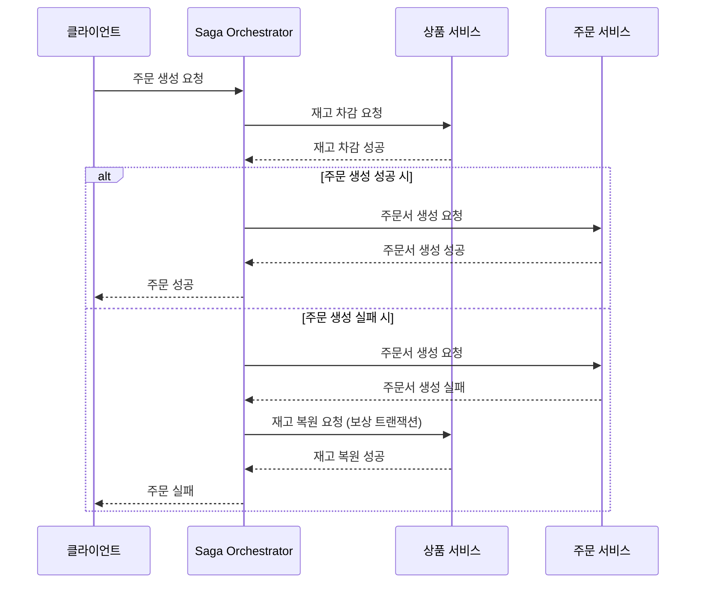
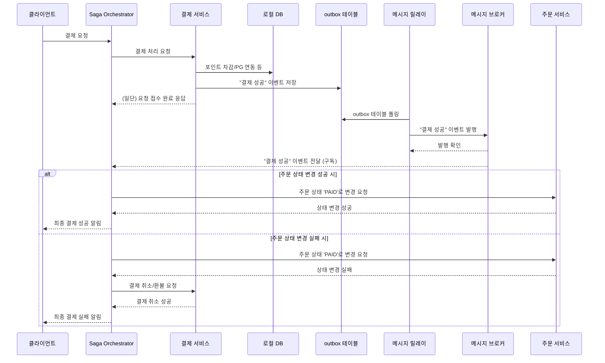

## 1. 개요
이 문서는 서비스의 도메인별 서버, DB 분리 시 발생하는 분산 트랜잭션 문제와 그에 대한 해결 방안을 기술하는 것을 목적으로 한다.

## 2. 분리 시 트랜잭션 처리의 한계
기존의 모놀리식 아키텍처에서는 단일 데이터베이스 내에서 ACID를 보장하는 트랜잭션 처리가 간단하다. 하지만 도메인별로 데이터베이스가 분리되면 하나의 비즈니스 로직이 여러 DB에 걸쳐 실행되어야 하는 상황이 발생한다.

예시) `주문`, `결제`
1. **주문**
- 주문 생성 시 `재고 차감`과 `주문 생성` 두 가지 작업이 여러 서비스에 걸쳐서 일어날 수 있다.
```
1. 상품 서비스 : 사용자가 주문한 상품의 재고를 차감
2. 주문 서비스 : 결제 대기 상태로 주문을 생성한다.
```
**문제점 :** 1번(재고 차감)은 성공했지만 일시적인 장애로 인해 2번(주문 생성)이 실패한다면 재고는 차감되지만 주문은 존재하지 않는 문제가 발생하여 다른 사용자가 상품을 구매하지 못하게 될 수 있다.

2. **결제**
- `결제 대기`상태의 `주문`에 대해 결제를 진행 시 여러 서비스에 걸쳐서 일어날 수 있다.
```
1. 결제 서비스 : 사용자의 포인트를 차감하거나 외부 PG를 통해 결제를 완료시킨다.
2. 주문 서비스 : 결제 완료 후 기존 주문의 상태를 `결제 완료`로 변경한다.
```
**문제점 :** 1번(결제 성공)이후 2번(주문 상태 변경)과정에서 장애가 발생하면 사용자의 포인트/돈은 지불됐지만 주문은 결제 대기 상태로 남게 된다. 이로 인해 상품의 발송이 누락될 수 있다.

## 3. 대응 방안
트랜잭션의 문제를 해결하기 위해서 Saga 패턴과 신뢰성을 위해 Outbox를 함께 사용한다.
</br>
어디서 문제가 생겼는지 빠르게 파악하기 위해서 Saga 패턴 중에서도 Orchestration을 이용하여 구현한다. 

### Saga 패턴
1. **코레오그래피 방식**:
    - 중앙의 조정자 없이 각 서비스가 이벤트를 발행하면 다음 트랜잭션을 수행해야 할 서비스가 해당 이벤트를 구독하여 자신의 트랜잭션을 수행하는 방식이다.
    - **장점**: 서비스 간 결합도가 낮고 구현이 비교적 단순하다.
    - **단점**: 전체 트랜잭션 흐름을 파악하기 어렵고, 서비스 수가 많아지면 의존 관계가 복잡해져 디버깅이 어렵다.

2. **오케스트레이션 방식**:
    - 'Saga Orchestrator'라는 중앙 서비스가 전체 트랜잭션의 흐름을 관리한다. Orchestrator가 각 서비스에 트랜잭션을 수행하도록 명령하고 결과에 따라 다음 단계를 결정하거나 보상 트랜잭션을 명령한다.
    - **장점**: 전체 비즈니스 프로세스가 중앙에서 관리되어 흐름 파악과 디버깅이 용이하다.
    - **단점**: Orchestrator에 로직이 집중되어 복잡해질 수 있고, SPOF가 될 가능성이 있다.

## 4. Saga 흐름
### 1. 주문 생성


### 2. 결제 처리
