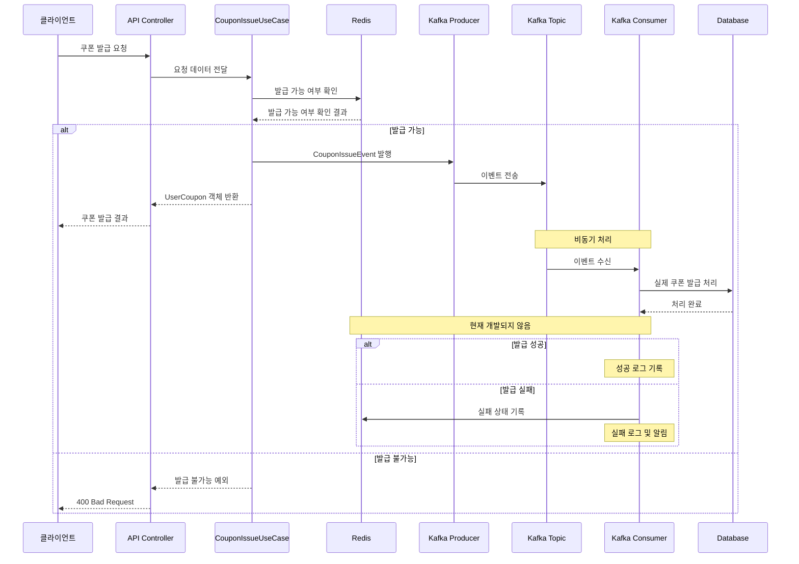

# 쿠폰 발급 시스템 Kafka 설계 문서
## 1. 설계 목적
- 대용량 쿠폰 발급 요청에 대한 안정적인 처리
- 비동기 메시징을 통한 시스템 확장성 향상

## 2. 기존 프로세스 한계
- 데이터 손실 위험
  - 기존 프로세스는 RDB, AOF설정이 되어 있지 않아 서버 재시작 시 데이터 손실
  - 설정이 되어있다 하더라도 대용량 데이터의 경우 RDB로딩에 상당한 시간이 필요
- 백업 및 복구의 복잡성
  - 메모리 덤프 생성 시 성능에 영향을 주기 때문에 실시간 백업의 어려움
  - 특정 시점으로의 정확한 복구가 어러움
- 메모리 용량의 한계
  - 대용량 데이터 저장 시 높은 메모리 비용
  - 대용량 메모리 사용 시 GC로 인한 지연

## 3. Kafka를 이용한 개선
- 영속성 보장
  - Redis (임시 저장) → Kafka → RDB (영구 저장)
- 확장성
  - 단일 Redis 인스턴스 → Kafka 파티션 기반 분산 처리
    - 파티션별 독립적 처리로 수평적 확장
    - 컨슈머 그룹을 통한 병렬 처리
    - 파티션 수 = 최대 동시 처리 인스턴스 수

## 4. 구조
- 현재 : Redis에서 선착순 보장과 발급을 한 번에 처리함
- 변경 후 : Redis에서 선착순을 보장하고 Kafka에서 비동기로 쿠폰을 발급

## 5. 흐름도
